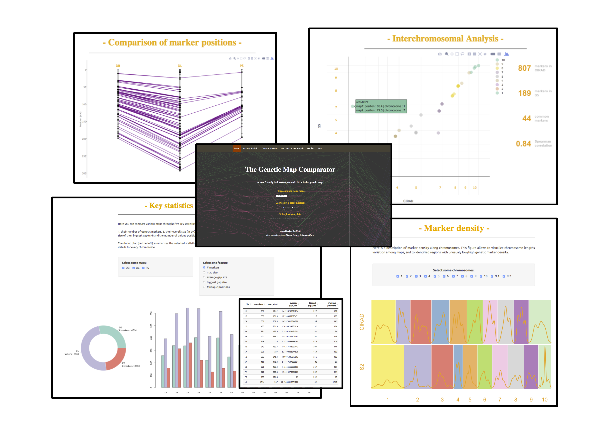

The Genetic Map Comparator
===================

Overview
--------
The Genetic Map Comparator is an R Shiny application made to compare genetic maps.  
You can use it trough the [**online version**](https://www.agap-sunshine.inra.fr/genmapcomp/) and read the related publication in [**bioinformatics**](https://www.r-graph-gallery.com).  
  
Once your dataset is uploaded you can explore it using the various sheets accessible via links at the top of the window. Each sheet helps you to study some specific features of your maps, they allow you to compare your maps via standard statistics (number of markers, average gap size between markers etc.) as well as to obtain a visual representation of your map congruences by plotting marker positions along chromosomes.  
  
Here is a screenshot of the main sheets of the app:



Input Format
--------
The Genetic map comparator is able to import map files produced by most commonly used software for linkage analysis (e.g. [Carthagene](https://www.ncbi.nlm.nih.gov/pubmed/9322047) and [JoinMap](https://www.kyazma.nl/index.php/mc.JoinMap)). Each map must be stored in its own file and all data files stored together in one specific folder. Use the upload facility of the home page to browse your local folders and select desired maps using multiple file selection. The column name has no impact but must be ordered correctly (see details and example below) and be separated by either ‘;’ or tabulation (‘\t’). See an extensive description of the accepted inputs in the [help page](www.agap-sunshine.inra.fr/genmapcomp/) of the online application. 

Local use
--------
If you don't want to use the online version, you can use the tool locally.
You need R to be installed on your computer & several libraries to be installed.
See the code below:
```
library(shiny)
runApp()
```

Citing 
--------
If you find The Genetic Map Comparator useful, please cite:  
The Genetic Map Comparator: a user-friendly application to display and compare genetic maps.  
*Yan Holtz, Jacques David, Vincent Ranwez*, **Bioinformatics 2016** (in press)

Members
--------
The genetic map comparator has been developped by 3 researchers from [Montpellier Supagro](www.supagro.fr/):  
Yan Holtz: [homepage](https://holtzyan.wordpress.com/)  
Jacques David: [homepage](https://www.researchgate.net/profile/Jacques_David4)  
Vincent Ranwez: [homepage](https://sites.google.com/site/ranwez/)  
  
We would like to thank **Cédric Goby** for his help during the shiny server deployment and **François Lechevallier** for developing and maintaining the website of the application.  


